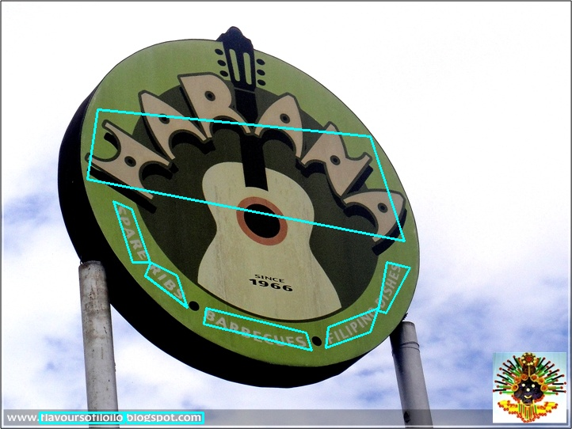
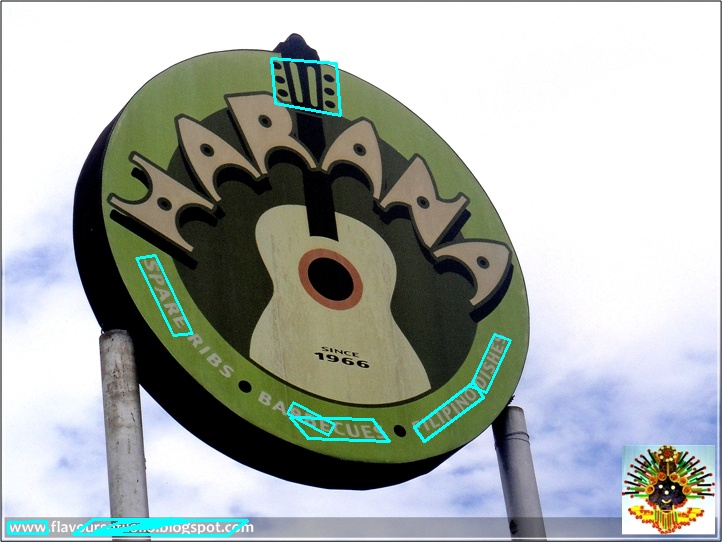
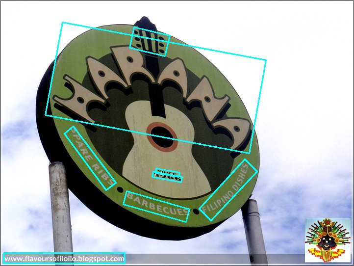
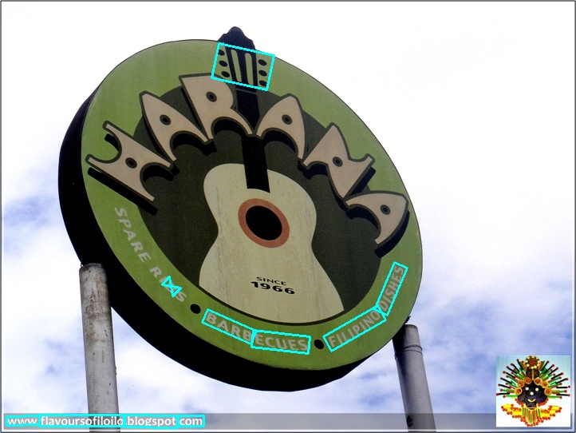

# Comparision of text detection algorithm in PP-OCRv3

---

<i><b>We are using the same Dataset and input to see how each algorithm worked.</b></i>

---

## CT

Paper:

> [<ins>CentripetalText: An Efficient Text Instance Representation for Scene Text Detection</ins>](https://arxiv.org/abs/2107.05945)

#### Result:

<i>Time using: 8.1408 seconds</i>

<i>Time using: 6.2326 seconds</i>

---

## DB

Paper:

> [<ins>Real-time Scene Text Detection with Differentiable Binarization</ins>](https://arxiv.org/abs/1911.08947)

> [<ins>Real-Time Scene Text Detection with Differentiable Binarization and Adaptive Scale Fusion</ins>](https://arxiv.org/abs/2202.10304)

#### Result:

<i>Time using: 6.8406 </i>

<i>Time using: 5.4410 </i>

---

## EAST

Paper:

> [<ins>EAST: An Efficient and Accurate Scene Text Detector</ins>](https://arxiv.org/abs/1704.03155)

#### Result:

<i>Time using: 7.4379 </i>

<i>Time using: 6.6536 </i>

## FCENet

Paper:

> [<ins>Fourier Contour Embedding for Arbitrary-Shaped Text Detection</ins>](https://arxiv.org/abs/2104.10442)

#### Result:

<i>Time using: 12.0690 </i>

<i>Time using: 12.5654 </i>

## PSENet

Paper:

> [<ins>Shape robust text detection with progressive scale expansion network</ins>](https://arxiv.org/abs/1903.12473)

#### Result:

<i>Time using: 11.3555 </i>

<i>Time using: 8.7616 </i>

